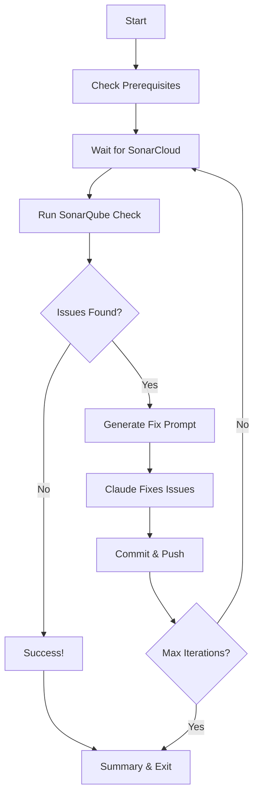

# /sonar-fix - Claude Slash Command

## Overview
An intelligent Claude Code slash command that automates the entire SonarQube issue fixing workflow for pull requests. This command creates an interactive loop where Claude analyzes, fixes, commits, and monitors SonarQube issues until all are resolved.

## Purpose
This command eliminates the manual back-and-forth of:
1. Running SonarQube checks
2. Fixing issues
3. Committing changes
4. Waiting for CI/CD
5. Checking if issues are resolved
6. Repeating until clean

Instead, it orchestrates the entire process automatically, with Claude doing the fixing and the script handling everything else.

## Features
- 🔄 **Automated Fix Loop** - Continuously fixes issues until resolved
- 📊 **Smart Issue Analysis** - Prioritizes issues by severity
- 🤖 **Claude Integration** - Generates targeted fix prompts
- 📦 **Auto-commit** - Commits and pushes fixes automatically
- 📈 **Progress Tracking** - Tracks iterations and fixed issues
- ⏱️ **Timeout Protection** - Prevents infinite loops
- 📝 **Detailed Logging** - Full audit trail of actions

## Usage

### Basic Command
```bash
/sonar-fix 172
```
This will start fixing SonarQube issues for PR #172.

### With Options
```bash
# Limit to 5 iterations maximum
/sonar-fix 172 --max-iterations 5

# Auto-commit without waiting for confirmation
/sonar-fix 172 --auto-commit

# Show detailed logging
/sonar-fix 172 --verbose

# Combine options
/sonar-fix 172 --max-iterations 3 --auto-commit --verbose
```

## Command Line Options

| Option | Description | Default |
|--------|-------------|---------|
| `--max-iterations <n>` | Maximum number of fix cycles | 10 |
| `--auto-commit` | Automatically commit without waiting | false |
| `--verbose` | Show detailed logging output | false |
| `--help` | Show help message | - |

## How It Works

### The Fix Loop



### Step-by-Step Process

1. **Prerequisites Check**
   - Verifies git repository
   - Confirms PR exists
   - Checks SonarQube configuration

2. **Wait for SonarCloud**
   - Monitors PR checks every 10 seconds
   - Proceeds when SonarCloud analysis completes
   - Times out after 10 minutes

3. **Run SonarQube Analysis**
   - Executes `sonarqube-check.js` for the PR
   - Generates markdown report with all issues
   - Counts total issues by severity

4. **Generate Fix Prompt**
   - Creates detailed prompt for Claude
   - Includes issue priorities and guidelines
   - Saves to `.claude-fix-prompt-<pr>.md`

5. **Claude Fixes Issues**
   - Claude reads the prompt
   - Makes necessary code changes
   - Script detects file changes or waits for input

6. **Commit and Push**
   - Stages all changes
   - Commits with descriptive message
   - Pushes to PR branch

7. **Repeat or Complete**
   - Loops back to step 2
   - Continues until issues resolved or max iterations

## Output Files

| File | Description |
|------|-------------|
| `.sonar-fix-<pr>.json` | Current status and progress |
| `.sonar-fix-<pr>.log` | Detailed execution log |
| `.sonar-issues-<pr>.md` | Latest SonarQube issues report |
| `.claude-fix-prompt-<pr>.md` | Current fix prompt for Claude |

## Example Session

```bash
$ /sonar-fix 172

🚀 Starting SonarQube fix loop for PR #172
   Max iterations: 10
   Auto-commit: false
🔍 Checking prerequisites...
✅ Prerequisites check passed

🔄 === Iteration 1/10 ===
⏳ Waiting for SonarCloud analysis to complete...
✅ SonarCloud analysis complete: failure
🔍 Running SonarQube analysis...
📊 Found 11 issues
📝 Fix prompt generated and saved to .claude-fix-prompt-172.md

================================================================================
📋 CLAUDE: Please fix the following issues:
================================================================================
# 🔧 SonarQube Fix Task - Iteration 1

## PR Information
- PR Number: #172
- Issues Found: 11
- Previous Iterations: 0

## Issues to Fix
[... detailed issues list ...]

================================================================================
⏸️ Waiting for fixes... When done, type "continue"
================================================================================

[Claude makes fixes...]

📦 Committing and pushing changes...
✅ Changes committed and pushed
⏳ Waiting for GitHub to process changes...

🔄 === Iteration 2/10 ===
[... continues until clean ...]

🎉 All SonarQube issues resolved!

================================================================================
📊 FIX LOOP SUMMARY
================================================================================
   PR Number: #172
   Iterations: 2
   Issues Fixed: 11
   Final Status: ✅ PASSING
================================================================================
```

## Integration with Claude Code

This command is designed specifically for Claude Code workflows:

### Claude's Role
1. **Reads Fix Prompts** - Gets detailed issue information
2. **Makes Code Changes** - Fixes issues following guidelines
3. **Preserves Functionality** - Ensures no breaking changes

### Script's Role
1. **Manages Workflow** - Handles all automation
2. **Monitors Progress** - Tracks CI/CD status
3. **Commits Changes** - Handles git operations

### Guidelines for Claude
When the fix prompt appears, Claude should:
- Fix issues by severity (BLOCKER → CRITICAL → MAJOR → MINOR)
- Avoid risky refactoring for cognitive complexity
- Focus on clear, safe fixes
- Preserve all existing functionality

## Best Practices

### DO:
- ✅ Run from the repository root
- ✅ Ensure you're on the correct branch
- ✅ Set SonarQube environment variables
- ✅ Review commits before pushing (without --auto-commit)
- ✅ Monitor the log file for issues

### DON'T:
- ❌ Run multiple instances for the same PR
- ❌ Interrupt during commit/push operations
- ❌ Ignore timeout warnings
- ❌ Skip prerequisite checks

## Troubleshooting

| Issue | Solution |
|-------|----------|
| "Not in a git repository" | Run from project root |
| "PR not found" | Verify PR number and GitHub access |
| "SonarQube environment not set" | Set SONARQUBE_URL, SONARQUBE_TOKEN |
| "No changes detected" | Check if Claude made fixes |
| "Timeout waiting for SonarCloud" | Check PR status manually |

## Advanced Usage

### Custom Iteration Limits
For large PRs with many issues:
```bash
/sonar-fix 172 --max-iterations 20
```

### Automated CI/CD Pipeline
For fully automated fixing:
```bash
/sonar-fix 172 --auto-commit --max-iterations 5
```

### Debug Mode
For troubleshooting:
```bash
/sonar-fix 172 --verbose
```

## Configuration

### Environment Variables
```bash
export SONARQUBE_URL=https://sonarcloud.io
export SONARQUBE_TOKEN=your_token_here
export SONARQUBE_PROJECT_KEY=your_project_key
```

### Git Configuration
Ensure git is configured:
```bash
git config user.name "Your Name"
git config user.email "your.email@example.com"
```

## Limitations

1. **Cognitive Complexity** - May not fix complex refactoring issues
2. **Breaking Changes** - Claude avoids risky changes
3. **API Rate Limits** - GitHub API has rate limits
4. **Timeout Limits** - 10-minute timeout for each wait

## Related Commands and Scripts

- `sonarqube-check.js` - Manual SonarQube analysis
- `monitor-pr-checks.js` - Monitor PR status
- `monitor-pr-agentic.js` - Background PR monitoring
- `claude-pr-workflow.sh` - Alternative workflow script

## Future Enhancements

- [ ] Support for multiple PRs simultaneously
- [ ] Selective issue fixing (by severity/type)
- [ ] Integration with other linters/analyzers
- [ ] Rollback capability on test failures
- [ ] Parallel fixing for independent issues

## Tips for Success

1. **Start Small** - Test on PRs with few issues first
2. **Monitor Progress** - Watch the iteration count
3. **Review Changes** - Check commits before final merge
4. **Use Logs** - Review `.sonar-fix-<pr>.log` for details
5. **Clean Up** - Remove `.sonar-*` files when done

This command transforms the tedious process of fixing SonarQube issues into a simple slash command that Claude can execute autonomously!